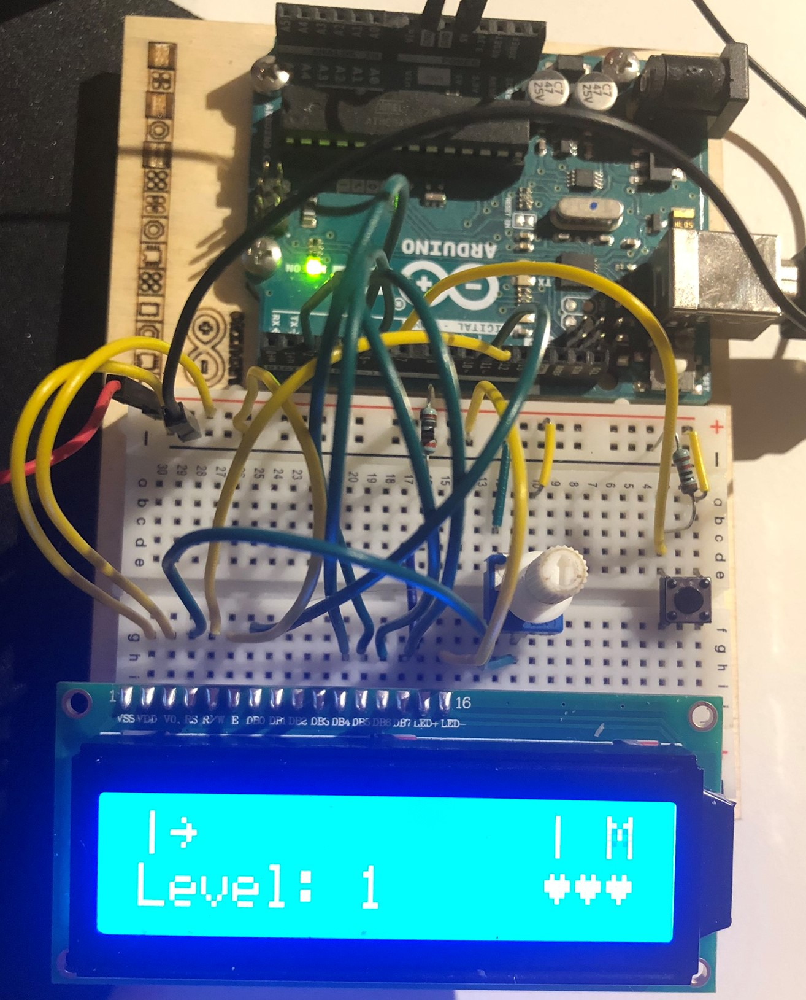

# Arduino Game

27.-28. Dezember 2021

## Circuit

Circuit follows Starter-Kit project 11 with additional button.

## Game Instructions

The character in the upper right corner changes, you have to press the button when there's an X. Pressing the button right fills up the bar with one additional arrow, else you loose a heart. When you have lost all three hearts, you loose, when the bar is filled up with 12 arrows, you level up and the characters change 10% faster.

